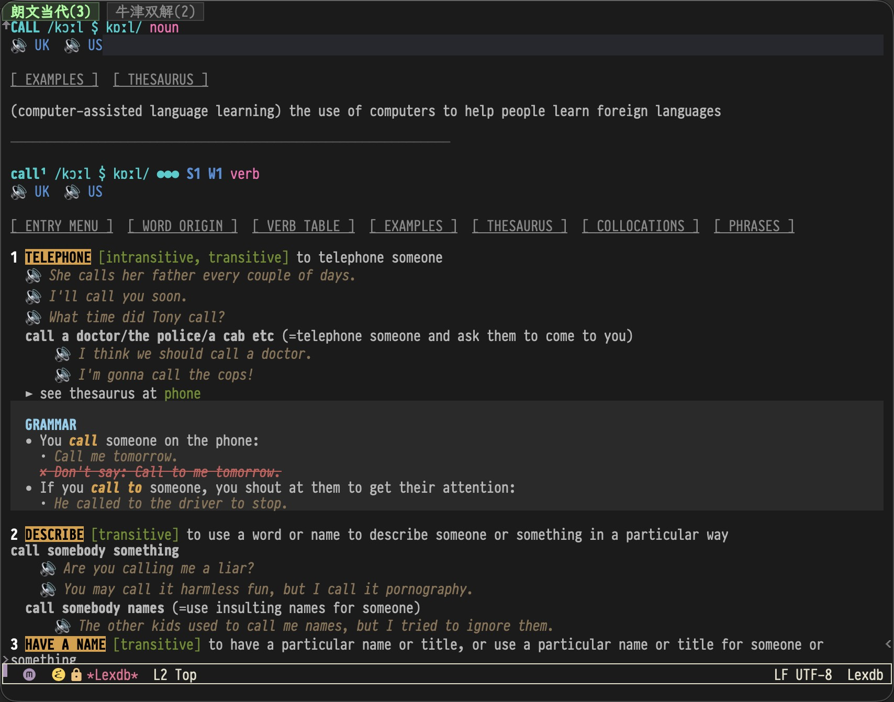
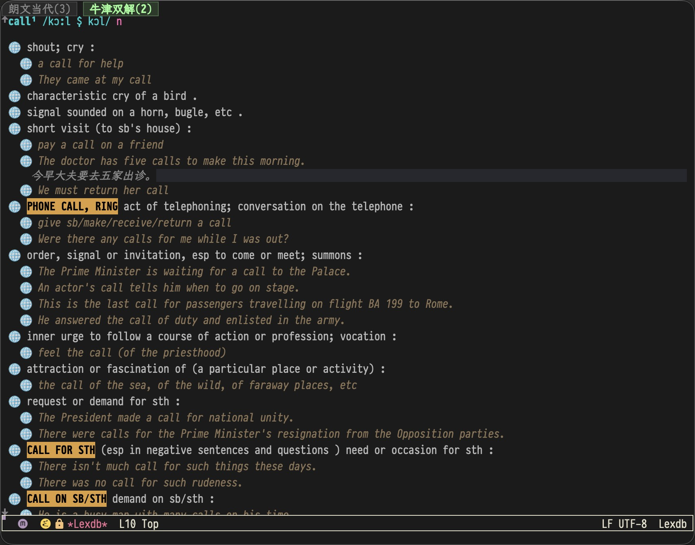

# LexDB

Emacs 词典查询系统，将 MDX 词典转换为 SQLite 数据库，提供快速查词、多词典切换、音频播放等功能。

## 功能

- 🔍 快速查词，支持词形还原
- 📚 多词典并行查询，Tab 切换
- 🔊 英/美式发音播放（本地/在线）
- 🌐 中文翻译 Peek 显示（按 `t` 临时查看）
- 🔗 交叉引用跳转，义项精准定位
- 📖 imenu 支持，快速跳转义项
- 📦 习语、短语动词、搭配、语法框等完整支持

## 截图





## 文件结构

```
├── lexdb.el              # 核心数据结构和 API
├── lexdb-ui.el           # Emacs UI 渲染
├── lexdb-ldoce.el        # LDOCE 词典适配器
├── lexdb-oald.el         # OALD 词典适配器
├── lexdb-ode.el          # ODE 词典适配器
├── schema.md             # Schema 规范文档
├── assets/
│   ├── screenshot.jpg
│   └── screenshot1.jpg
└── scripts/
    ├── lexdb_common.py   # Python 通用模块
    ├── mdx2db.py         # MDX → SQLite 转换 (LDOCE)
    ├── mdx2db_oald.py    # MDX → SQLite 转换 (OALD)
    ├── mdx2db_ode.py     # MDX → SQLite 转换 (ODE)
    └── extract_html.py   # MDX html 提取工具
```

## 快速开始

### 1. 转换词典

```bash
# 安装依赖
pip install readmdict beautifulsoup4 lxml

# 转换 LDOCE
python mdx2db.py LDOCE6.mdx

# 转换 OALD
python mdx2db_oald.py OALD4.mdx

# 提取音频（可选）
python mdx2db.py LDOCE6.mdx --extract-audio
```

### 2. 配置 Emacs

```elisp
(add-to-list 'load-path "/path/to/lexdb")

;; 加载适配器（自动加载 lexdb 和 lexdb-ui）
(require 'lexdb-ldoce)
(require 'lexdb-oald)
(require 'lexdb-ode)

;; 配置词典
(setq lexdb-dictionaries
      '((:id ldoce
         :type ldoce
         :name "朗文当代"
         :db-file "~/dicts/LDOCE6.db"
         :audio-dir "~/dicts/audio/"
         :priority 1)
        (:id oald
         :type oald
         :name "牛津双解"
         :db-file "~/dicts/OALD4_EC.db"
         :priority 2)
        (:id ode
         :type ode
         :name "牛津英语"
         :db-file "~/dicts/ODE_Living_Online.db"
         :priority 3)))

;; 初始化
(lexdb-init)

;; 绑定快捷键
(global-set-key (kbd "C-c d") 'lexdb-search)
```

### 3. 使用

| 快捷键 | 功能 |
|--------|------|
| `s` | 搜索新词 |
| `n/p` | 上/下一个义项 |
| `1-9` | 跳转到义项 |
| `t` | Peek 翻译 |
| `C-c C-c` | 播放音频 |
| `>/<` | 切换词典 |
| `l/r` | 历史前进/后退 |
| `M-g i` | imenu 跳转 |
| `q` | 关闭 |

## 支持的词典

| 词典 | 转换脚本 | 备注 |
|------|----------|------|
| LDOCE 6 | mdx2db.py | 朗文当代英语词典 |
| OALD 4 | mdx2db_oald.py | 牛津高阶英汉双解词典 |
| ODE | mdx2db_ode.py | 牛津英语词典（在线版） |

## 下载

词典数据库和 MDX 文件体积较大，不便放在 GitHub，请从以下链接下载：

| 资源 | 下载链接 |
|------|----------|
| 预构建数据库 (db) | [Dropbox](https://www.dropbox.com/scl/fo/99uuvwpop8soyalrerwci/AIkVDmWhcjA-uc8vcDZTTj8?rlkey=ojfwecu3ftghq2vuwapd3icnc&st=46ou7ce1&dl=0) |
| ODE Living Online (mdx) | [Dropbox](https://www.dropbox.com/scl/fo/yxopdizb4ec1efpjnue6w/AL4bIrweIQ9T2EK9fMUdb7Q?rlkey=3b2ve6lsmgay2ddc0lmhkhgaa&st=xwnt5pt6&dl=0) |
| OALD4 双解 (mdx) | [Dropbox](https://www.dropbox.com/scl/fi/fuvc12vu0j7p6zrx9vcvg/OALD4-Dual-Language-Fall-2022.rar?rlkey=o7hrwtjarwtnql8gg54i4o12z&st=tbggft44&dl=0) |
| LDOCE 6 (mdx) | [Dropbox](https://www.dropbox.com/scl/fo/hnop12hlfqj59ye3p2v76/AMZ_49qy3r9BwyG7VaUciCw?rlkey=1qzqro950otfxahy9h2pvaxc7&st=5cga1drx&dl=0) |

## 依赖

**Python:**
- readmdict
- beautifulsoup4
- lxml

**Emacs:**
- Emacs 27+
- sqlite3 支持

## License

MIT
