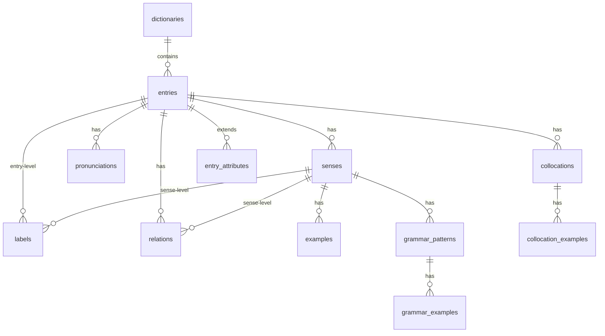
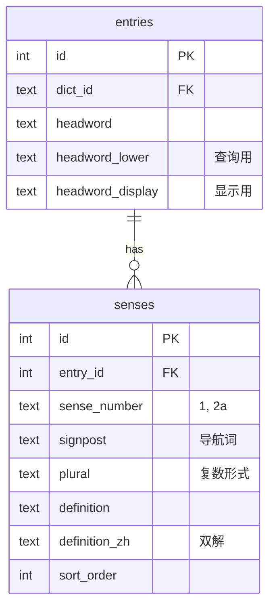
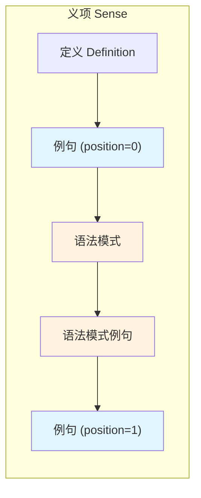
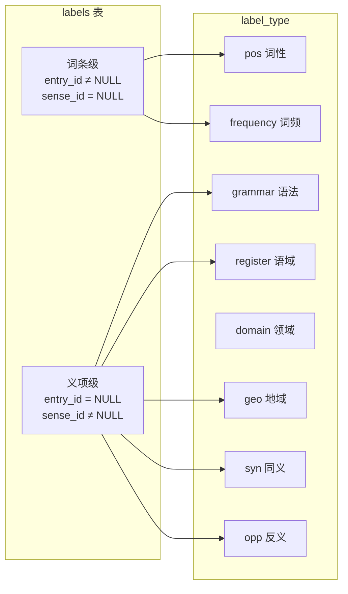
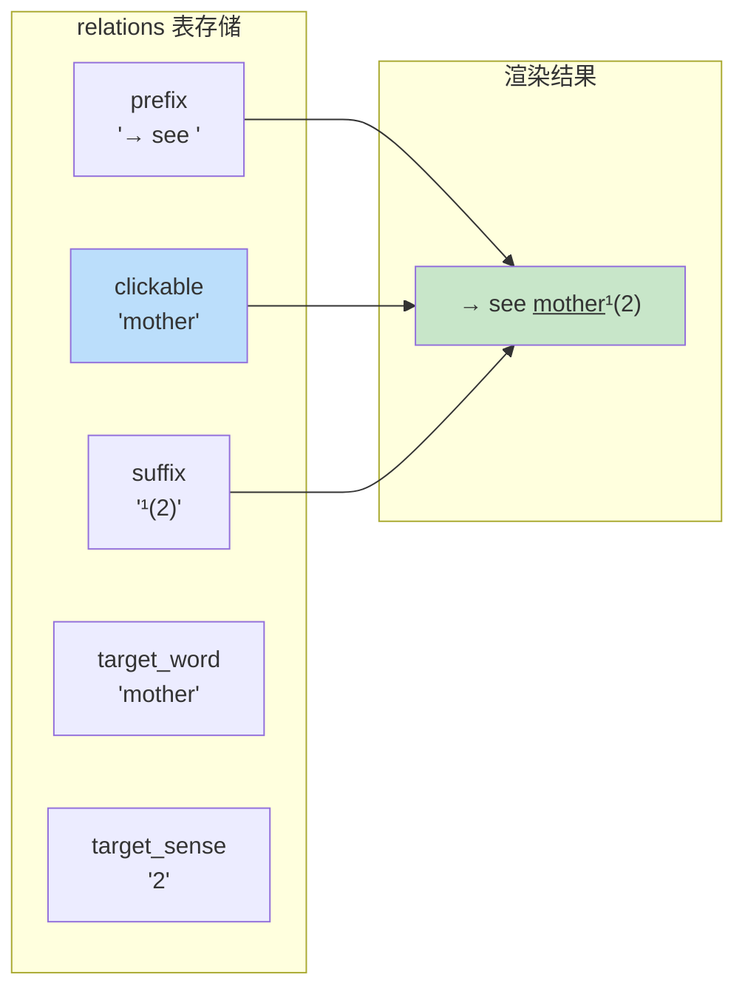
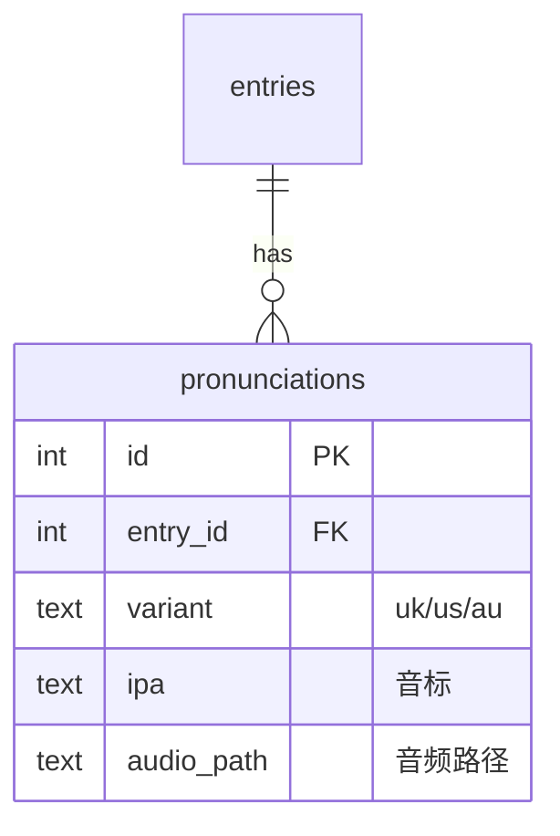
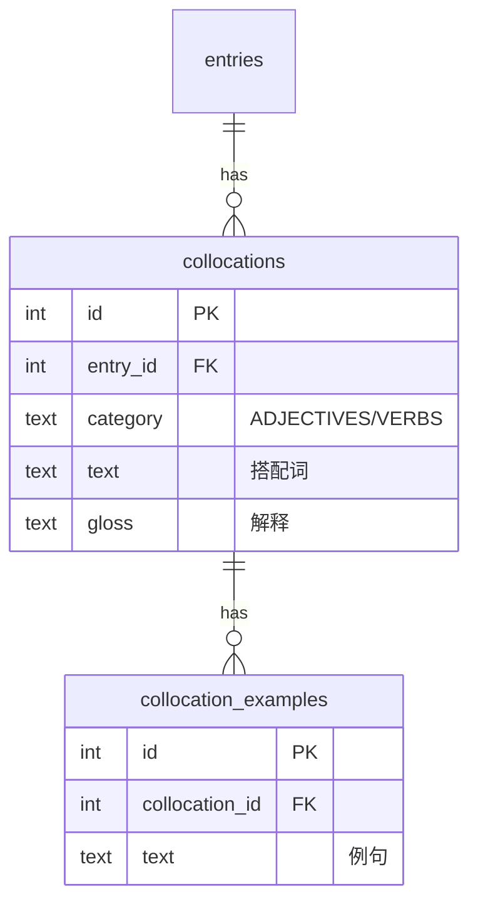
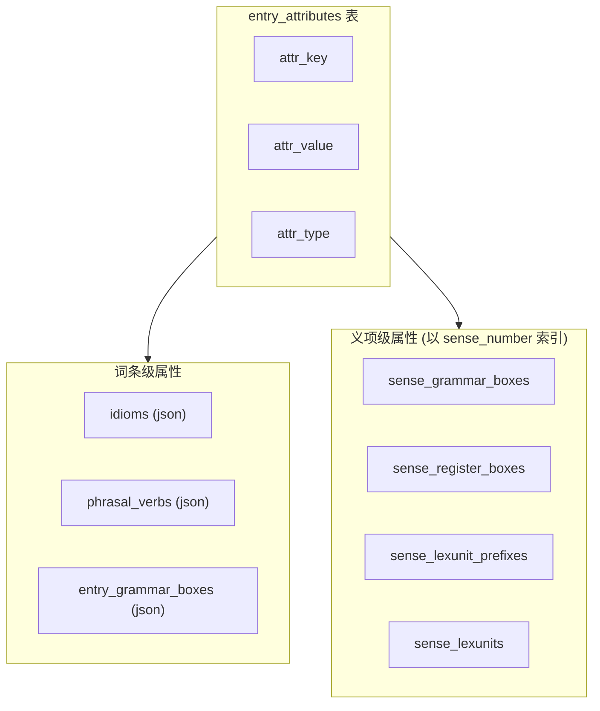
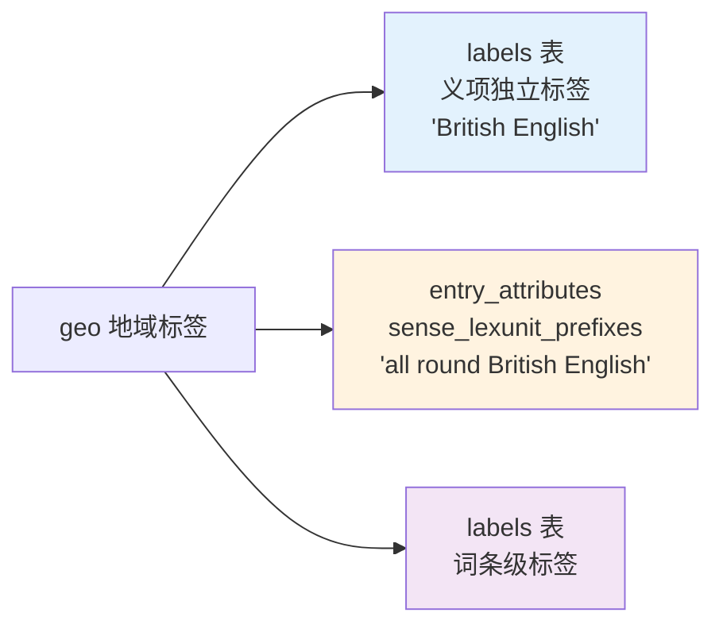

# LexDB Schema 规范

本文档定义了 LexDB 词典数据库的标准 Schema。任何词典只要按此规范生成 SQLite 数据库，即可被 LexDB Emacs 客户端无缝使用。

## 概述

LexDB 采用 **"能力感知"** 设计：
- 词典只需填充它拥有的数据，缺失字段留 NULL
- Emacs UI 会自动检测并只渲染存在的内容
- 扩展数据通过 `entry_attributes` 表存储，无需修改 Schema

---

## 表关系总览



---

## 核心表：词条与义项



### `entries` - 词条主表

```sql
CREATE TABLE entries (
    id INTEGER PRIMARY KEY,
    dict_id TEXT NOT NULL,           -- 所属词典
    headword TEXT NOT NULL,          -- 词头，如 "mother"
    headword_lower TEXT NOT NULL,    -- 小写形式，用于查询
    headword_display TEXT            -- 显示形式，如 "moth·er"
);

CREATE INDEX idx_entries_headword ON entries(headword_lower);
CREATE INDEX idx_entries_headword_dict ON entries(dict_id, headword_lower);
```

### `senses` - 义项表

```sql
CREATE TABLE senses (
    id INTEGER PRIMARY KEY,
    entry_id INTEGER NOT NULL REFERENCES entries(id),
    sense_number TEXT,               -- 义项编号，如 "1", "2a"
    signpost TEXT,                   -- 导航词，如 "PARENT", "LIQUID"
    plural TEXT,                     -- 复数形式，如 "(pl manifestos or manifestoes)"
    definition TEXT NOT NULL,        -- 英文释义
    definition_zh TEXT,              -- 中文释义（双解词典）
    sort_order INTEGER DEFAULT 0
);

CREATE INDEX idx_senses_entry ON senses(entry_id);
```

---

## 例句与语法模式



### `examples` - 例句表

```sql
CREATE TABLE examples (
    id INTEGER PRIMARY KEY,
    sense_id INTEGER NOT NULL REFERENCES senses(id),
    text TEXT NOT NULL,              -- 英文例句
    text_zh TEXT,                    -- 中文翻译
    audio_path TEXT,                 -- 例句音频路径
    position INTEGER DEFAULT 0,      -- 位置：0=语法模式前，1=语法模式后
    sort_order INTEGER DEFAULT 0
);

CREATE INDEX idx_examples_sense ON examples(sense_id);
CREATE INDEX idx_examples_position ON examples(sense_id, position);
```

**position 字段说明：**

| position | 渲染位置 | 典型用途 |
|----------|----------|----------|
| `0` | grammar_patterns 之前 | 普通例句（默认） |
| `1` | grammar_patterns 之后 | 补充例句 |

### `grammar_patterns` - 语法模式表

```sql
CREATE TABLE grammar_patterns (
    id INTEGER PRIMARY KEY,
    sense_id INTEGER NOT NULL REFERENCES senses(id),
    pattern TEXT NOT NULL,           -- 语法模式，如 "on a ... day"
    gloss TEXT,                      -- 简短解释，如 "(=during a particular day)"
    sort_order INTEGER DEFAULT 0
);
```

### `grammar_examples` - 语法模式例句表

```sql
CREATE TABLE grammar_examples (
    id INTEGER PRIMARY KEY,
    pattern_id INTEGER NOT NULL REFERENCES grammar_patterns(id),
    text TEXT NOT NULL,
    audio_path TEXT,
    sort_order INTEGER DEFAULT 0
);
```

---

## 标签系统



### `labels` - 统一标签表

```sql
CREATE TABLE labels (
    id INTEGER PRIMARY KEY,
    entry_id INTEGER,                -- 词条级标签
    sense_id INTEGER,                -- 义项级标签
    label_type TEXT NOT NULL,        -- 标签类型
    label_value TEXT NOT NULL,       -- 标签值
    sort_order INTEGER DEFAULT 0
);

CREATE INDEX idx_labels_entry ON labels(entry_id);
CREATE INDEX idx_labels_sense ON labels(sense_id);
```

**label_type 枚举：**

| 类型 | 级别 | 说明 | 示例值 |
|------|------|------|--------|
| `pos` | 词条 | 词性 | noun, verb, adjective |
| `grammar` | 义项 | 语法代码 | [C], [U], [Tn], [I] |
| `register` | 义项 | 语域 | formal, informal, literary |
| `geo` | 义项 | 地域 | British English, American English |
| `domain` | 义项 | 领域 | medical, legal, computing |
| `syn` | 义项 | 同义词 | SYN happy |
| `opp` | 义项 | 反义词 | OPP sad |
| `frequency` | 词条 | 词频 | S1, W2 |

---

## 关系与交叉引用



### `relations` - 关系表（Fragment 格式）

```sql
CREATE TABLE relations (
    id INTEGER PRIMARY KEY,
    entry_id INTEGER NOT NULL REFERENCES entries(id),
    sense_id INTEGER,                -- NULL = 词条级别
    relation_type TEXT NOT NULL,     -- 关系类型
    prefix TEXT,                     -- 不可点击前缀
    clickable TEXT NOT NULL,         -- 可点击部分
    suffix TEXT,                     -- 不可点击后缀
    target_word TEXT NOT NULL,       -- 跳转目标词（规范化）
    target_sense TEXT,               -- 目标义项编号
    sort_order INTEGER DEFAULT 0
);
```

**渲染示例：**

| 原文 | prefix | clickable | suffix | target_word | target_sense |
|------|--------|-----------|--------|-------------|--------------|
| `→ for all sb cares at care²(8)` | `→ for all sb cares at ` | `care²` | `(8)` | `care` | `8` |
| `SYN happy` | `SYN ` | `happy` | | `happy` | |

**relation_type 枚举：**

| 类型 | 说明 |
|------|------|
| `cross_ref` | 交叉引用 → see X |
| `synonym` | 同义词 SYN |
| `antonym` | 反义词 OPP |
| `thesaurus` | 同义词库引用 |
| `see_also` | 另见 |
| `inflection` | 词形变化 |
| `compare` | 比较 |

---

## 发音与音频



### `pronunciations` - 发音表

```sql
CREATE TABLE pronunciations (
    id INTEGER PRIMARY KEY,
    entry_id INTEGER NOT NULL REFERENCES entries(id),
    variant TEXT,                    -- uk, us, au
    ipa TEXT,                        -- IPA 音标
    audio_path TEXT,                 -- 音频文件路径
    sort_order INTEGER DEFAULT 0
);
```

---

## 搭配 (Collocations)



### `collocations` - 搭配表

```sql
CREATE TABLE collocations (
    id INTEGER PRIMARY KEY,
    entry_id INTEGER NOT NULL REFERENCES entries(id),
    category TEXT,                   -- 搭配类别，如 "ADJECTIVES", "VERBS"
    text TEXT NOT NULL,              -- 搭配文本
    gloss TEXT,                      -- 解释
    sort_order INTEGER DEFAULT 0
);
```

### `collocation_examples` - 搭配例句表

```sql
CREATE TABLE collocation_examples (
    id INTEGER PRIMARY KEY,
    collocation_id INTEGER NOT NULL REFERENCES collocations(id),
    text TEXT NOT NULL,
    sort_order INTEGER DEFAULT 0
);
```

---

## 扩展属性 (EAV 模式)



### `entry_attributes` - 扩展属性表

```sql
CREATE TABLE entry_attributes (
    id INTEGER PRIMARY KEY,
    entry_id INTEGER NOT NULL REFERENCES entries(id),
    attr_key TEXT NOT NULL,          -- 属性键
    attr_value TEXT,                 -- 属性值（TEXT 或 JSON）
    attr_type TEXT DEFAULT 'text',   -- 类型提示
    UNIQUE(entry_id, attr_key)
);
```

**attr_type 枚举：**

| 类型 | 说明 |
|------|------|
| `text` | 纯文本 |
| `json` | JSON 格式 |
| `json_compressed` | zlib 压缩的 JSON |
| `integer` | 整数 |

### 常用 attr_key

**词条级：**

| attr_key | 类型 | 说明 |
|----------|------|------|
| `ldoce/frequency` | text | 词频 "S1 W2" |
| `ldoce/homograph` | text | 同形词号 |
| `idioms` | json | 习语列表 |
| `phrasal_verbs` | json | 短语动词 |
| `entry_grammar_boxes` | json | 词条级语法框 |

**义项级（以 sense_number 为 key 的 JSON 对象）：**

| attr_key | 说明 |
|----------|------|
| `sense_grammar_boxes` | `{"1": {...}, "2": {...}}` |
| `sense_register_boxes` | 语域框 |
| `sense_lexunit_prefixes` | 词组前缀（含地域变体） |
| `sense_lexunits` | 词组用法 |

---

## JSON 数据结构示例

### sense_lexunit_prefixes（词组 + 地域变体）

```json
{
  "7": [
    {"type": "lexunit", "text": "all round"},
    {"type": "geo", "text": "British English"},
    {"type": "lexvar", "text": "all around"},
    {"type": "geo", "text": "American English"}
  ]
}
```

渲染：`all round British English, all around American English`

### idioms（习语）

```json
[
  {
    "text": "necessity is the mother of invention",
    "definition": "used to say that when you are in difficulty...",
    "definition_zh": "需要是发明之母",
    "examples": [
      {"text": "...", "text_zh": "..."}
    ]
  }
]
```

### sense_grammar_boxes（语法框）

```json
{
  "1": {
    "heading": "GRAMMAR: Patterns with all",
    "notes": [
      {
        "text": "You use all the or all of the before...",
        "expr": "all the, all of the",
        "examples": ["All the students passed."],
        "bad_example": "All of students..."
      }
    ]
  }
}
```

---

## 渲染顺序

```mermaid
flowchart TB
    subgraph sense_render["义项渲染顺序"]
        n1["1. sense_number 义项编号"]
        n2["2. 🌐 翻译指示器"]
        n3["3. signpost 导航词"]
        n4["4. grammar labels [C][U]"]
        n5["5. lexunit_prefix 词组前缀"]
        n6["6. register/geo labels"]
        n7["7. definition 释义"]
        n8["8. syn/opp labels"]
        n9["9. examples (position=0)"]
        n10["10. grammar_patterns + gloss"]
        n11["11. grammar_examples"]
        n12["12. examples (position=1)"]
        n13["13. subsenses/grammar_box/lexunits"]
    end

    n1 --> n2 --> n3 --> n4 --> n5 --> n6 --> n7 --> n8 --> n9 --> n10 --> n11 --> n12 --> n13
```



**视觉效果：**

```
1 🌐 PARENT [C] a female parent of a child or animal SYN mom
  🔊🌐 The mother of three young children
  [on a ... day] (=during a particular day)
    🔊 On a clear day you can see the mountains.
  🌐 She became a mother at 18.
```

---

## 元信息表

### `dictionaries` - 词典元信息

```sql
CREATE TABLE dictionaries (
    id INTEGER PRIMARY KEY,
    dict_id TEXT UNIQUE NOT NULL,    -- 词典标识 "ldoce6"
    name TEXT NOT NULL,              -- 词典名称
    version TEXT,
    source_file TEXT,
    capabilities TEXT,               -- JSON 数组
    created_at TEXT,
    entry_count INTEGER DEFAULT 0
);
```

### `_lexdb_meta` - Schema 元信息

```sql
CREATE TABLE _lexdb_meta (
    key TEXT PRIMARY KEY,
    value TEXT
);

-- 必须包含：
INSERT INTO _lexdb_meta VALUES ('schema_version', '2.1');
```

---

## 能力声明

在 `dictionaries.capabilities` 中声明词典支持的功能（JSON 数组）：

```json
["pronunciation", "audio-uk", "audio-us", "frequency-band", "collocations", "chinese-definition", "chinese-example"]
```

| 能力 | 说明 |
|------|------|
| `lookup` | 基础查词 |
| `definition` | 英文释义 |
| `chinese-definition` | 中文释义 |
| `chinese-example` | 例句中文翻译 |
| `pronunciation` | 音标 |
| `audio-uk` / `audio-us` | 英/美式发音 |
| `audio-example` | 例句音频 |
| `examples` | 例句 |
| `collocations` | 搭配 |
| `idioms` | 习语 |
| `phrasal-verbs` | 短语动词 |
| `thesaurus` | 同义词库 |
| `frequency-band` | 词频等级 |
| `signpost` | 导航词 |
| `grammar-box` | 语法框 |
| `register-box` | 语域框 |

---

## 同一数据的不同存储位置

某些数据类型（如 geo）可能出现在不同上下文：



---
